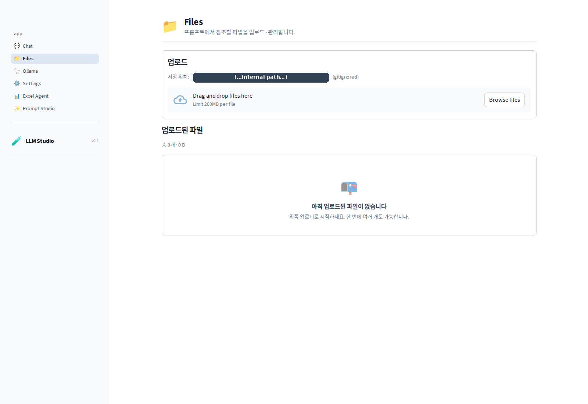
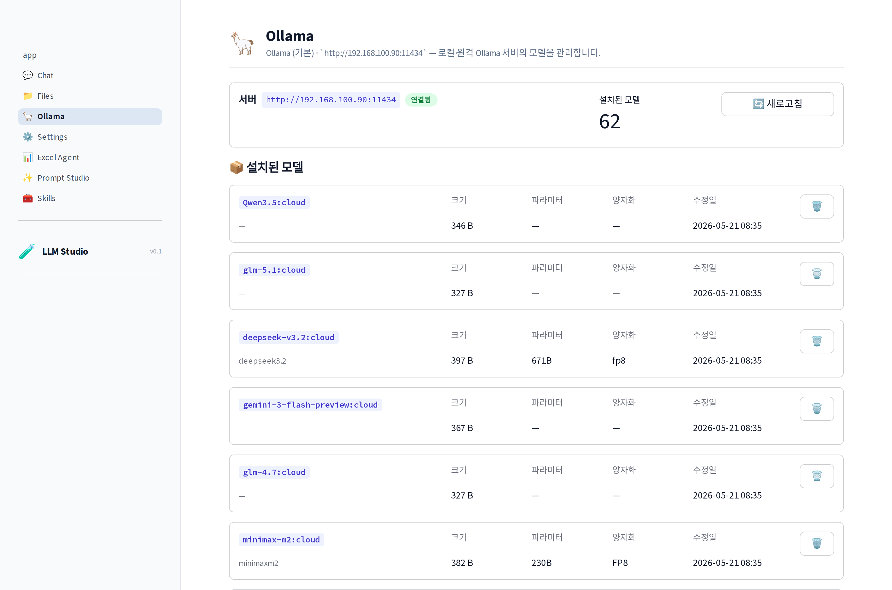
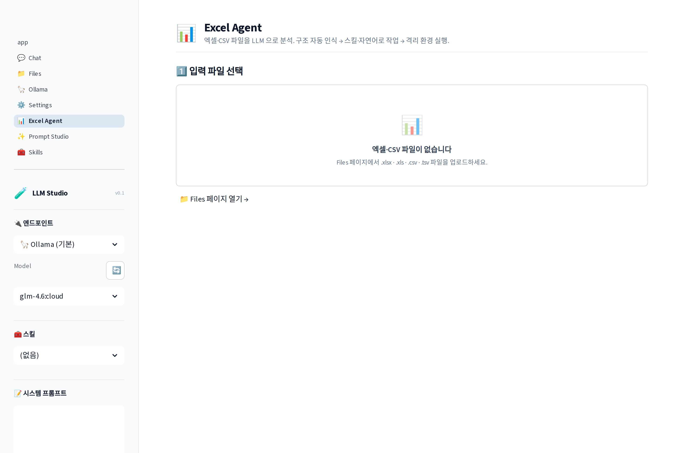
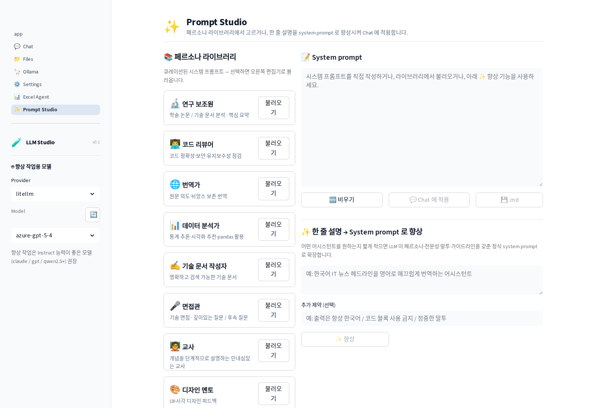
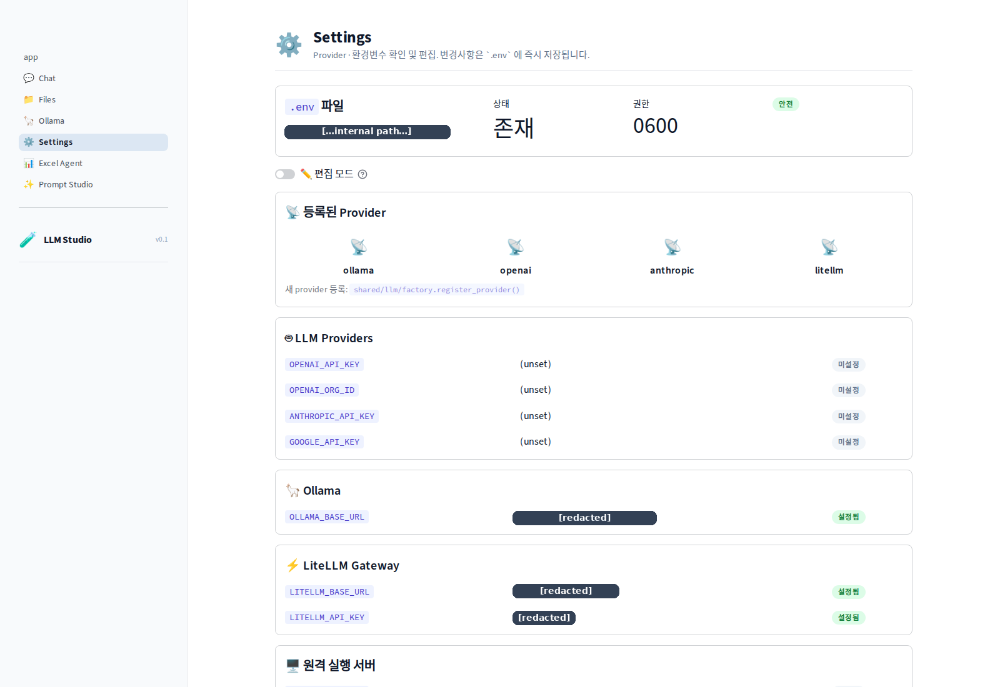

# AI-tools

> 다양한 AI / LLM 기술을 활용한 도구들의 **공개(public) 모노레포**.
> 첫 번째 도구는 **LLM Studio** — Streamlit 기반 멀티 provider 플레이그라운드.

[](https://www.python.org/)
[](https://streamlit.io/)
[](#)

---

## 한 줄 요약

```
Ollama · OpenAI · Anthropic · LiteLLM Gateway 를 하나의 Streamlit UI 에서 호출,
파일을 업로드해 첨부하고, 엑셀을 자연어로 처리하고, 페르소나로 시스템 프롬프트를 다듬는다.
```

---

## 🖼️ 실행 화면

> 스크린샷은 [`docs/screenshots/`](docs/screenshots/) — 직접 띄워서 캡처 후 그 폴더에 추가하면 아래에 노출됩니다. 캡처 가이드는 [docs/screenshots/README.md](docs/screenshots/README.md).

| 랜딩 | Chat | Files |
|---|---|---|
|  |  |  |

| Ollama | Excel Agent | Prompt Studio | Settings |
|---|---|---|---|
|  |  |  |  |

---

## ✨ 기능

### 💬 Chat — 멀티 provider 대화
- Provider 4개를 단일 인터페이스로 (Ollama · OpenAI · Anthropic · **LiteLLM Gateway**)
- 모델 리스트 **provider 에서 자동 조회** (5분 캐시 + 새로고침)
- 스트리밍 응답 (글자 흐름)
- 응답 후 메트릭: 응답시간 · 출력 토큰 · 청크 수
- **📎 파일 첨부** — Files 폴더의 텍스트 파일(md/csv/json/py/yaml/…) 멀티 선택 후 system prompt 끝에 컨텍스트로 합산 (파일당 50KB · 합산 200KB)
- 대화 → `.md` 다운로드 또는 **Files 폴더에 저장** (다음 대화의 첨부로 재사용 → 도구 간 고리)

### 📁 Files — 업로드 / 리스트 / 삭제
- 다중 드래그-드롭 업로드
- 확장자별 아이콘 (PDF / xlsx / csv / py / …)
- 다운로드 / 삭제 / 토스트 알림
- 저장 위치는 gitignored (`AI/llm-studio/data/uploads/`)
- 경로-안전 `FileManager` — `../` traversal, `/abs`, `\\winpath` 모두 거부

### 🦙 Ollama — 로컬·원격 모델 관리
- 서버 상태 (`OLLAMA_BASE_URL` 자동 사용) + 헬스 체크
- **설치 모델 테이블**: 이름 · 크기 · 파라미터 · 양자화 · 수정일 · 🗑️ 삭제
- **인기 모델 원클릭 Pull** — llama3.2:1b/3b, llama3.1:8b, qwen2.5:7b, mistral:7b, gemma2:2b, phi3:mini, deepseek-r1:7b + 임베딩 (nomic-embed-text, mxbai-embed-large)
- **실시간 진행률**: `MB / total · %` 와 status 메시지를 streaming
- 직접 입력 탭 — 임의 모델명 / 사용자네임스페이스 지원

### 📊 Excel Agent — 자연어 → pandas → 격리 실행
- Files 폴더의 .xlsx/.xls/.csv/.tsv 멀티 선택
- **스키마 미리보기**: 컬럼 + dtype + 상위 3행
- **셀 카운터**: 문자 입력된 행/열/셀 개수 자동 계산
- LLM 이 작업 설명을 받아 **pandas 스크립트 생성** — 코드 편집 가능
- **subprocess 격리 실행**:
  - POSIX rlimit: 메모리(RLIMIT_AS) · CPU(RLIMIT_CPU) · FD(RLIMIT_NOFILE) · 코어 덤프 차단
  - 사용자 조정 타임아웃 (5-300s) · 메모리 (128-4096MB)
  - 신선한 임시 디렉토리 — 입력 파일만 시드, 출력은 신규 파일 자동 수집
- 결과: stdout / stderr / 신규 파일 다운로드 · CSV/Excel 미리보기 · **Files 폴더에 저장** (체이닝)

### ✨ Prompt Studio — 페르소나 + system prompt 향상기
- **페르소나 라이브러리** — 큐레이션된 8개 시스템 프롬프트 (연구 보조원 · 코드 리뷰어 · 번역가 · 데이터 분석가 · 기술 문서 작성자 · 면접관 · 교사 · 디자인 멘토)
- **user prompt → system prompt 향상기**: 한 줄 설명 → LLM 이 페르소나·전문성·말투·가이드라인까지 갖춘 시스템 프롬프트로 확장
- 편집 → **💬 Chat 에 적용** (session 동기화)

### ⚙️ Settings — 환경변수 보기 / 편집
- **편집 모드 토글** — OFF 시 마스킹된 읽기 전용, ON 시 폼으로 변환
- `.env` 직접 쓰기 — 신규 파일은 **자동 0600 권한** (소유자 읽기/쓰기만)
- 그룹화: LLM Providers · Ollama · LiteLLM Gateway · 원격 실행 서버 · 앱 기본값
- 키 이름 검증 (영숫자+`_`) — injection 차단
- 저장 시 캐시 자동 초기화 → 즉시 다른 페이지 반영

---

## 🚀 빠른 시작

### 사전 요구
- Python 3.10+
- (선택) [Ollama](https://ollama.com) — 로컬 / 원격 어디든 OK
- (선택) OpenAI / Anthropic 키 — Settings 페이지에서 입력
- (선택) LiteLLM Gateway 서버 — 사내 게이트웨이가 있다면 URL/키만 입력

### 설치 + 실행

```bash
# 의존성
pip install -e .                # 기본 (streamlit, requests, pandas, openpyxl, python-dotenv)
pip install -e '.[anthropic]'   # + Anthropic SDK
pip install -e '.[openai]'      # + OpenAI SDK
pip install -e '.[litellm]'     # + LiteLLM (Proxy 모드는 불필요)
pip install -e '.[all]'         # 전부

# Streamlit 실행
cd AI/llm-studio
streamlit run app.py
# → http://localhost:8501
```

### 환경변수 설정

**옵션 A** — Settings 페이지에서 편집 모드로 입력 (자동으로 `.env` 생성, 0600 권한)
**옵션 B** — 직접 작성:

```bash
cp .env.example .env
chmod 600 .env
# .env 편집
```

[.env.example](.env.example) 참고. 사용할 provider 의 키만 채우면 됩니다.

---

## 🏗️ 아키텍처

```
AI-tools/
├── README.md              ← (this file)
├── .gitignore             ← 비밀 · 데이터 · 모델 가중치 차단
├── .env.example           ← 환경변수 템플릿 (실제 값 없음)
├── pyproject.toml         ← 의존성 + provider 옵셔널 그룹
│
├── shared/                ← 프로젝트 전반 공용 모듈
│   ├── llm/
│   │   ├── base.py             · BaseLLMProvider · Message · ChatResponse · Chunk
│   │   ├── config.py           · .env 단일 진입점 (get_secret / set_secret / unset_secret / mask_secret)
│   │   ├── factory.py          · 지연 로딩 (get_provider 이름 → 인스턴스)
│   │   ├── personas.py         · 페르소나 라이브러리 + system prompt 향상 메타 프롬프트
│   │   └── providers/
│   │       ├── ollama_provider.py     · chat/stream + pull/list/delete/health
│   │       ├── openai_provider.py     · 옵셔널 deps
│   │       ├── anthropic_provider.py  · 옵셔널 deps
│   │       └── litellm_provider.py    · Proxy(requests, 패키지 불필요) + SDK(litellm) 자동 분기
│   ├── storage/
│   │   └── files.py            · 경로-안전 FileManager (traversal 차단)
│   └── execution/
│       └── sandbox.py          · subprocess + rlimit + timeout + 출력 수집
│
├── AI/                    ← AI 카테고리 (향후 다른 카테고리도 추가 가능)
│   ├── README.md
│   └── llm-studio/        ← Streamlit 앱
│       ├── app.py              · 랜딩 + 시스템 상태 대시보드
│       ├── _bootstrap.py       · sys.path + data dir 셋업
│       ├── components/         · 공통 위젯 (header, badge, empty_state, sidebar_brand)
│       ├── pages/
│       │   ├── 1_💬_Chat.py
│       │   ├── 2_📁_Files.py
│       │   ├── 3_🦙_Ollama.py
│       │   ├── 4_⚙️_Settings.py
│       │   ├── 5_📊_Excel_Agent.py
│       │   └── 6_✨_Prompt_Studio.py
│       └── data/               · 업로드 / 출력 (gitignored)
│
└── docs/
    └── screenshots/       ← README 의 실행 화면 (gitignored 아님)
```

### Provider 추상화

```python
from shared.llm import get_provider, Message

# 어떤 provider 든 동일 인터페이스
llm = get_provider("ollama",   model="llama3.2:3b")
llm = get_provider("openai",   model="gpt-4o-mini")
llm = get_provider("anthropic", model="claude-sonnet-4-6")
llm = get_provider("litellm",  model="claude-haiku-4-5")  # 게이트웨이

resp = llm.chat([Message("user", "안녕")])
for chunk in llm.stream([Message("user", "안녕")]):
    print(chunk.delta, end="", flush=True)
```

새 provider 추가는 `shared/llm/providers/` 에 파일 하나 + `factory.py:_PROVIDERS` 등록.

### LiteLLM 이중 모드

| 모드 | 트리거 | 패키지 |
|---|---|---|
| **Proxy** | `LITELLM_BASE_URL` 설정됨 | ❌ litellm 불필요 (requests 만) |
| **SDK** | `LITELLM_BASE_URL` 비어있음 | ✅ `pip install 'ai-tools[litellm]'` |

Proxy 모드는 사내 LiteLLM 서버를 단일 진입점으로 사용 — 키 관리/로깅/RL 을 중앙화. 우리 코드는 **OpenAI 호환 REST** 로 호출하므로 라이트.

---

## 🔐 보안 정책

**이 저장소는 공개(public) 입니다. 한 번 커밋된 비밀은 force-push 로도 완전히 지우기 어렵습니다.**

### 절대 커밋 금지
- API 키 / 토큰 / 비밀번호 / 접속정보
- 사용자 업로드 파일, 모델 가중치, 데이터셋
- `.env`, `*.key`, `*.pem`, `secrets/`, `credentials/`, `.streamlit/secrets.toml`

이미 [`.gitignore`](.gitignore) 가 차단하지만, 매 커밋마다 확인:

```bash
git diff --staged | grep -iE 'api.?key|secret|token|password|sk-[a-z0-9]'
```
출력이 있으면 커밋 중단.

### 비밀 다루기
1. **저장**: `.env` (gitignored, 0600 권한)
2. **선언**: 신규 키는 `.env.example` 에 이름만 (값 없이)
3. **로드**: `shared/llm/config.get_secret("KEY")` 만 사용 — 하드코딩 금지
4. **표시**: UI 에 표시할 땐 항상 마스킹 (`sk-...abcd`)
5. **사고 대응**: 실수로 커밋 → **즉시 키 무효화** → `git filter-repo` / BFG

### LLM 생성 코드 실행 (Excel Agent)
- 부모 process 안에서 절대 `exec()` 안 함
- 신선한 temp dir + subprocess + POSIX rlimit (메모리/CPU/FD) + hard timeout
- `subprocess.run` 의 env 를 화이트리스트로 — proxy 변수 제거

---

## 🧩 Claude Code / Codex Skills 와의 관계

> 회사 가이드라인상 우리 구현과 Claude Code / Codex 의 "skill" 개념을 비교합니다.

### Claude Code Skills 란
**Slash command** 형태로 사용자가 호출하는 모듈식 워크플로. 각 skill 은 다음을 묶음:
- 명령 정의 (`/security-review`, `/init`, `/review` 등)
- 트리거 조건 / 사전 컨텍스트
- 호출 시 실행할 도구 chain (Read · Bash · WebFetch …)
- 결과 처리 로직

기술적으로는 **prompt template + tool orchestration + 사용자 시동 진입점** 의 패키지입니다. Anthropic 에서 official set 을 제공하고, 사용자가 직접 만들 수도 있습니다.

### 우리 LLM Studio 와의 매핑

| Claude Code skill 개념 | 우리 구현 대응물 |
|---|---|
| Slash command (`/foo`) | **Streamlit 페이지** (사이드바 메뉴) |
| Skill 의 prompt template | **`shared/llm/personas.py`** + 각 페이지의 system prompt |
| Skill 의 tool orchestration | **각 페이지의 비즈니스 로직** (Excel Agent 의 LLM→pandas→sandbox 파이프라인) |
| Skill 의 사용자 시동 진입점 | **랜딩 페이지 카드 + 사이드바 nav** |
| MCP server (외부 도구 노출) | 우리는 직접 노출 X — Streamlit UI 만. **향후 MCP 어댑터** 로 expose 가능 |

### 구조적 유사성

- **Excel Agent** 는 본질적으로 hardcoded skill: "엑셀 처리" 라는 의도 → LLM 호출 (코드 생성) → tool 실행 (sandbox) → 결과 표시. Claude Code 에서 동일 기능을 만든다면 `/excel-merge` 같은 skill 로 구현될 것.
- **Prompt Studio** 의 페르소나 라이브러리는 **재사용 가능한 system prompt 모음** — Claude Code 의 `~/.claude/agents/*.md` 또는 plugin skill 의 prompt block 과 직접 대응.
- **Settings 페이지의 `.env` 편집** 은 Claude Code 의 `/config` 와 유사 — 사용자 환경을 메타 레벨에서 관리.

### 차이점

| | Claude Code | LLM Studio |
|---|---|---|
| 진입점 | 터미널 CLI | Streamlit 웹 UI |
| 사용자 시동 | `/skill-name` 명령 | 사이드바 메뉴 클릭 |
| LLM 제공자 | Claude 고정 | **4개 provider 다중** (Ollama · OpenAI · Anthropic · LiteLLM) |
| 도구 실행 | 내장 Tool (Read · Bash · …) | 페이지별 커스텀 (FileManager · sandbox · …) |
| 확장 | plugin / agent SDK | provider 추가 · 페이지 추가 |

### 시사점

향후 우리 Excel Agent / Prompt Studio 같은 **잘 정의된 워크플로** 를 Claude Code skill 로 포팅해 CLI 사용자도 쓸 수 있게 만들 수 있음. 반대로 우리는 더 시각적이고 비기술 사용자 친화적이라는 강점.

---

## 📁 카테고리 / 모듈 가이드

- [AI/](AI/README.md) — AI / LLM 도구 카테고리 (현재 위치)
- [shared/](shared/README.md) — 공용 모듈 사용법
- [AI/llm-studio/](AI/llm-studio/README.md) — Streamlit 앱 상세

향후 추가 예정 카테고리: `Web/`, `DevOps/`, `Data/` — 모두 같은 `shared/` 를 import.

---

## 🤝 기여

새 도구는 카테고리 안의 하위 폴더 (예: `AI/my-new-tool/`).
공용 로직은 반드시 `shared/` 로 추출.
PR 전 `.gitignore` 가 신규 데이터/비밀 경로를 커버하는지 확인.

## 라이선스

(TBD)
