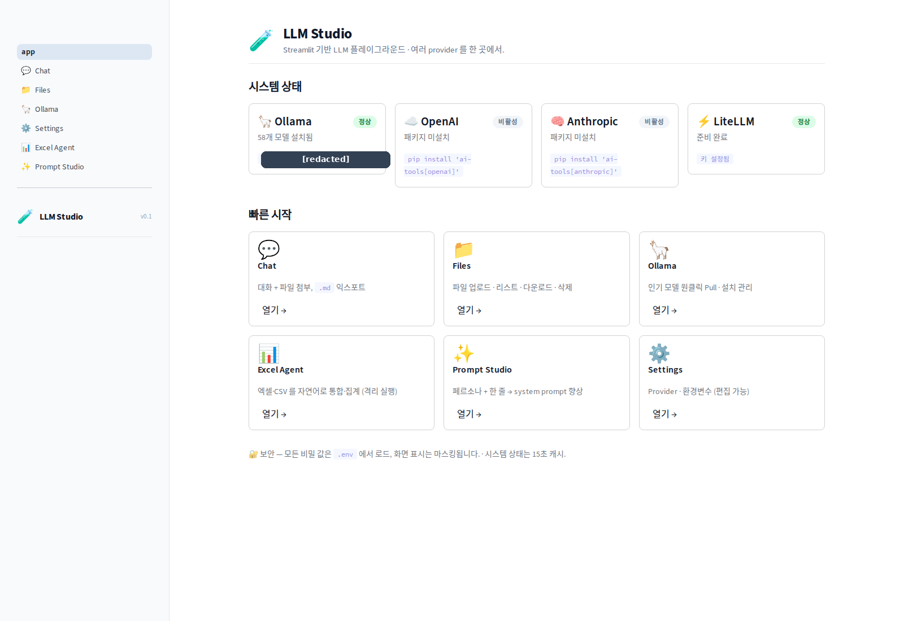
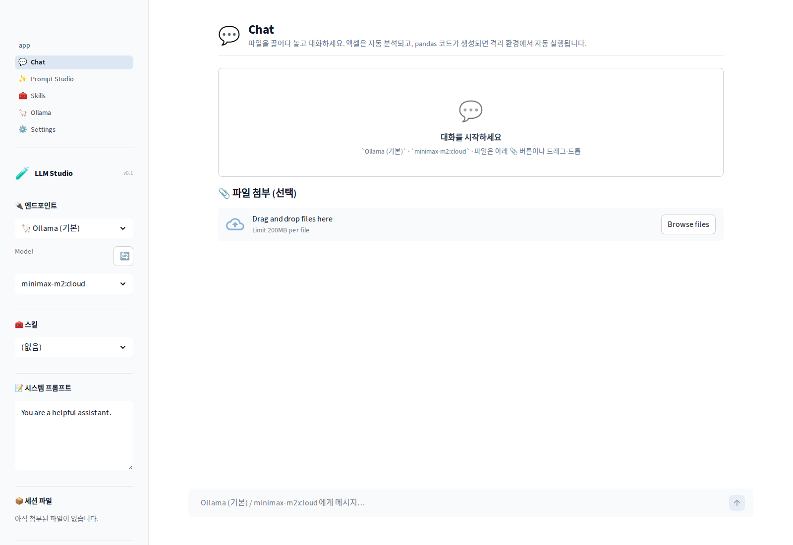
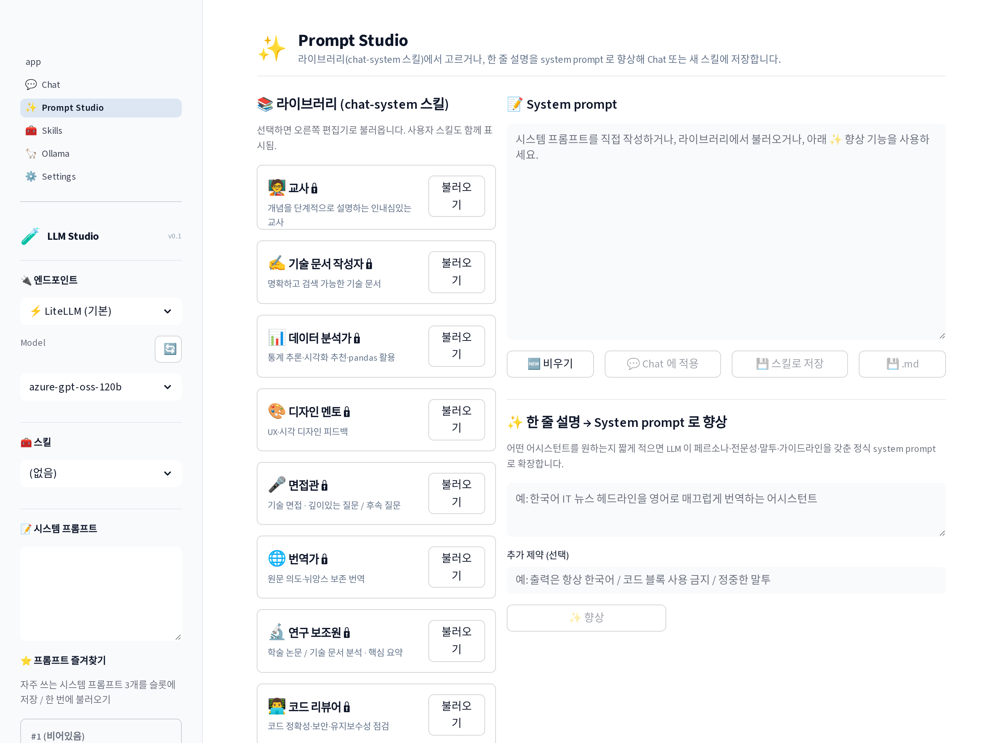
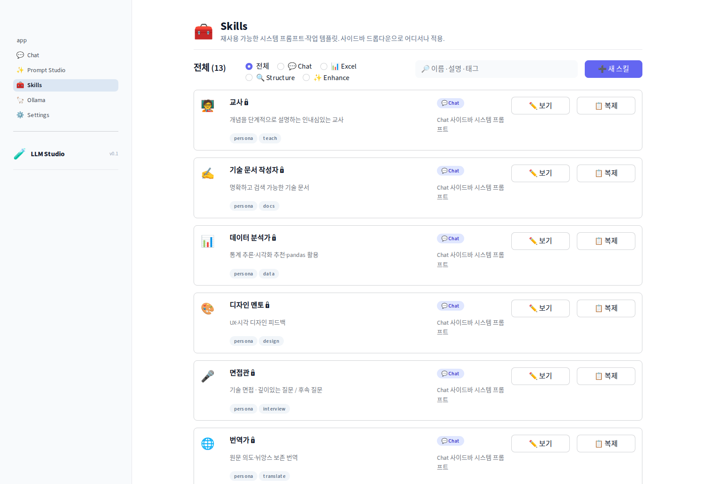
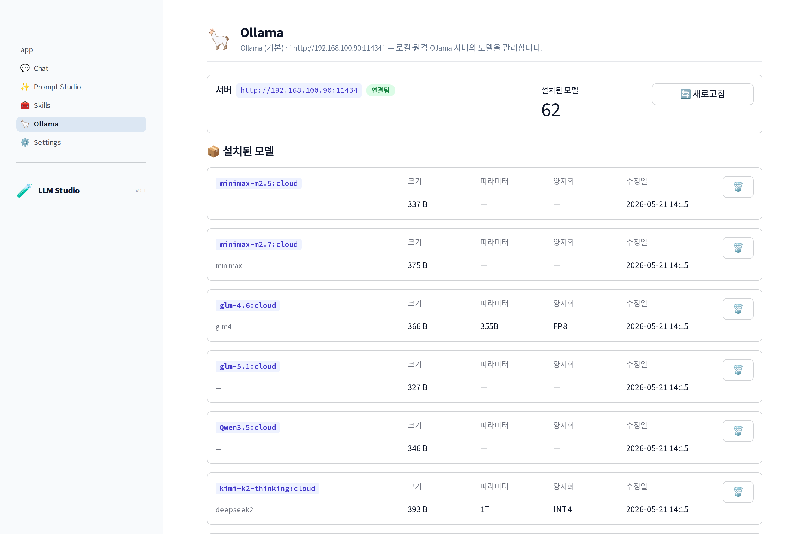
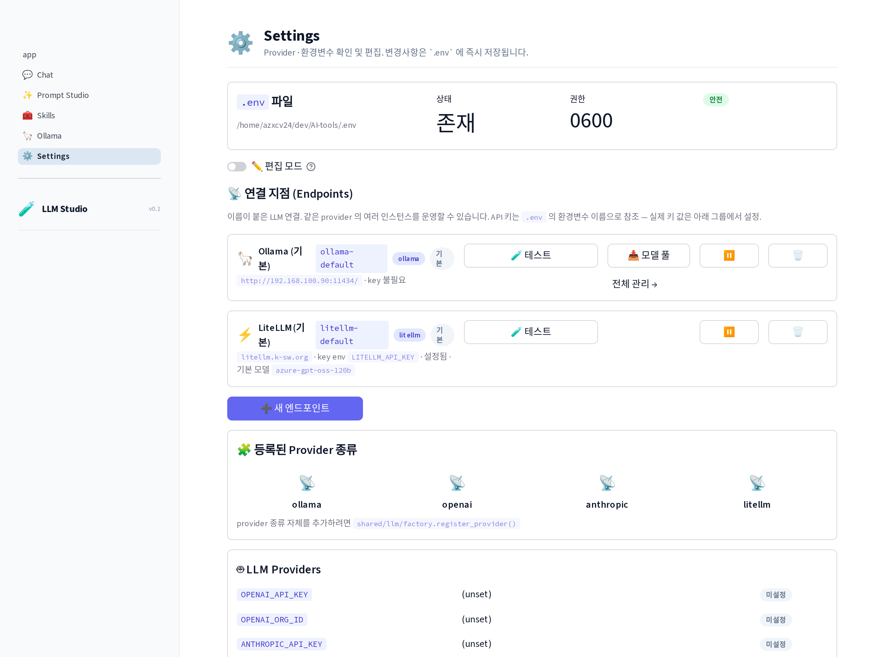
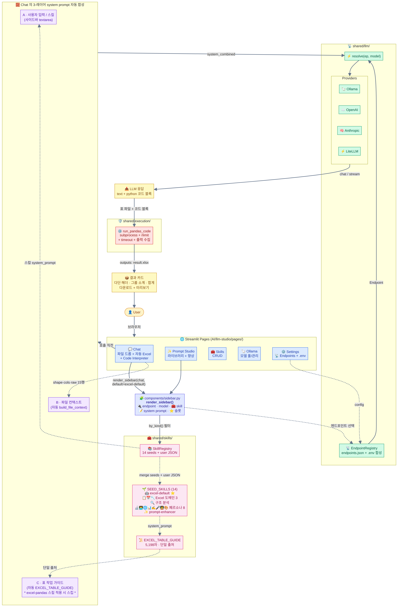
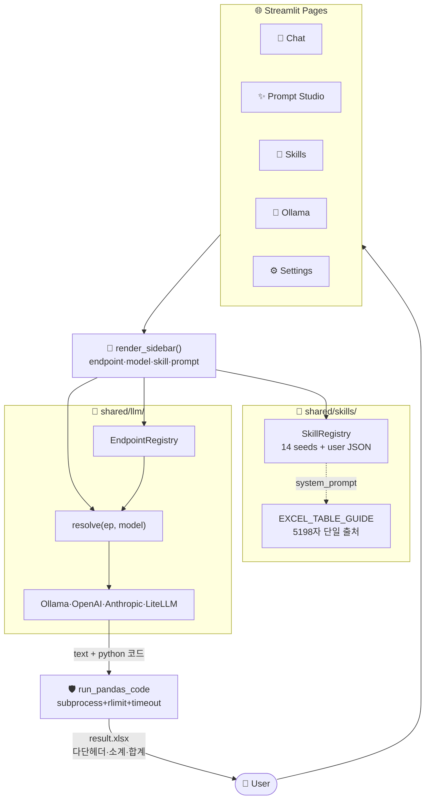

# AI-tools

> 다양한 AI / LLM 기술을 활용한 도구들의 **공개(public) 모노레포**.
> 첫 번째 도구는 **LLM Studio** — Streamlit 기반 멀티 provider 플레이그라운드.

[](https://www.python.org/)
[](https://streamlit.io/)
[](#)

---

## 한 줄 요약

```
ChatGPT 스타일 통합 채팅 한 곳에서 파일을 드롭하고 대화하면 — 엑셀은 자동 분석되고,
LLM 이 만든 pandas 코드는 격리 sandbox 에서 자동 실행되어 결과 파일이 메시지로 돌아온다.
멀티 provider 엔드포인트(Ollama · OpenAI · Anthropic · LiteLLM)와 재사용 스킬(작업 패턴) 지원.
```

---

## 🖼️ 실행 화면

> 스크린샷은 [`docs/screenshots/`](docs/screenshots/). 다시 캡처하려면 [docs/screenshots/README.md](docs/screenshots/README.md) 참고.

| 랜딩 | 💬 Chat (ChatGPT 스타일 통합 UI) | ✨ Prompt Studio |
|---|---|---|
|  |  |  |

| 🧰 Skills | 🦙 Ollama | ⚙️ Settings |
|---|---|---|
|  |  |  |

---

## ✨ 기능

### 🧰 Skills — 재사용 가능한 작업 단위 ⭐ 핵심 추가
- **`Skill = (system prompt + user prompt template + target page)`** — Persona 의 확장 개념
- **14개 시드 내장** (모두 `readonly=True`):
  - **🤖 `excel-default`** ⭐ — Chat 에 엑셀 첨부 시 자동 기본 선택. 다단 헤더 자동 인식 · 병합/공란/합계 행 구분 · 그룹 소계 + 합계 + 원본 양식 보존 (`EXCEL_TABLE_GUIDE` 5198자 단일 출처)
  - **Excel 도메인 4종**: 🔍 구조 자동 분석 · 📋 비목별 합계 · 📅 연차별 총예산 합산 · 📉 예산 vs 실적 차이 분석
  - **chat-system 8종**: 8개 페르소나 (연구 보조원 / 코드 리뷰어 / 번역가 / 데이터 분석가 / 기술 문서 작성자 / 면접관 / 교사 / 디자인 멘토)
  - **prompt-enhance 1종**: Prompt Studio 의 향상 메타 프롬프트
- **사용자 스킬**: `AI/llm-studio/data/skills/<slug>.json` 으로 1파일/1스킬 저장 (시드 slug 와 같으면 사용자 정의가 우선)
- **사이드바 드롭다운** — Chat / Prompt Studio 의 사이드바에서 즉시 적용. `kind` 별로 필터링되어 페이지마다 호환되는 스킬만 노출 (Chat 은 `chat-system` + `excel-pandas` 둘 다)
- **자동 기본 선택** — Chat 에 엑셀/CSV 첨부 시 `excel-default` 스킬이 사이드바에 자동 선택되어 시스템 프롬프트가 채워짐 (사용자가 다른 것을 명시 선택하면 그 선택 우선)
- **CRUD + 복제** — `📋 복제` 로 시드를 사용자 스킬로 변환해 자유 편집

### 📡 Endpoints — 명명된 LLM 연결 ⭐ 핵심 추가
- "회사 LiteLLM (서울)", "Anthropic — Sonnet 4.6" 같이 **같은 provider 의 여러 인스턴스** 운영 가능
- API 키는 **env 변수 *이름* 만 저장** — 실제 값은 `.env` 의 동일 키에서 `get_secret()` 으로 읽음 (0600 마스킹 파이프라인 보존)
- **자동 기본값**: Settings 의 `.env` 가 채워지면 4개의 기본 엔드포인트(`ollama-default` · `openai-default` · `anthropic-default` · `litellm-default`)가 자동 합성 — 첫 실행도 설정 0 으로 시작 가능
- **🧪 테스트**: 한 번 클릭으로 health/`list_models()` 확인
- Settings 의 ollama 엔드포인트는 `📥 모델 관리` → Ollama 페이지로 deep-link (`?endpoint=<slug>`)

### 💬 Chat — ChatGPT-style 통합 UI ⭐ 대규모 개편
**파일 업로드 · 분석 · 평균/통합 · 결과 다운로드를 단일 채팅에서 끝까지.**
- 사이드바: 🔌 엔드포인트 → Model 자동 조회(300s 캐시) → 🧰 스킬 → 📝 시스템 프롬프트
- **📎 인라인 파일 첨부** — 채팅 입력 영역에서 드래그-드롭. Excel·CSV·텍스트 모두 가능
- **자동 분석** — 엑셀 첨부 시 schema + 행/열 카운트 + dtype 을 LLM 컨텍스트에 자동 주입
- **Code Interpreter 동작** — 응답에 `python` 코드 블록이 있고 표 형식 파일이 컨텍스트에 있으면 **격리 sandbox 에서 자동 실행** → 신규 파일은 메시지 하단에 다운로드 버튼 + 미리보기로
- **원본 양식 보존 출력** — `excel-default` 스킬의 시스템 프롬프트가 LLM 에게 다단 헤더 복원 · 그룹별 소계 행 · 마지막 합계 행 · 천 단위 콤마 포맷까지 강제. 입력 엑셀과 같은 양식의 새 파일을 받게 됨.
- **누적 컨텍스트** — 첨부 파일 + sandbox 출력 파일이 세션 동안 유지되어 후속 메시지 ("방금 result 에서 Seoul 만") 에서 그대로 참조 가능
- 스트리밍 응답 + 응답 후 메트릭(시간·토큰·청크·sandbox 실행 시간)
- 대화 → `.md` 다운로드

> 🛡 **격리 sandbox**: POSIX rlimit(메모리·CPU·FD·코어덤프) + hard timeout + 신선한 임시 디렉토리. 입력 파일만 시드, 출력은 신규 파일 자동 수집.

### 🦙 Ollama — 로컬·원격 모델 관리
- 서버 상태 + 헬스 체크 + `?endpoint=<slug>` 로 다중 서버 지원
- **설치 모델 테이블**: 이름·크기·파라미터·양자화·수정일·🗑️ 삭제
- **인기 모델 원클릭 Pull** + 직접 입력 탭 — llama3.2 / 3.1, qwen2.5, mistral, gemma2, phi3, deepseek-r1, nomic-embed, mxbai-embed
- 실시간 진행률: `MB / total · %` 와 status 메시지 streaming

### ✨ Prompt Studio — 라이브러리 + system prompt 향상기
- **라이브러리**가 이제 `SkillRegistry.by_kind("chat-system")` 기반 — 시드 8개 + 사용자가 만든 chat-system 스킬이 함께 표시
- **한 줄 설명 → LLM → 정식 system prompt** 확장(향상)
- 편집 → **💬 Chat 에 적용** (session 동기화) 또는 **💾 스킬로 저장**

### ⚙️ Settings — 📡 엔드포인트 + 환경변수
- 상단 **📡 연결 지점 (Endpoints)** — 카드별 🧪 테스트 / ✏️ 편집 / 🗑️ 삭제(커스텀만) / ⏸️ 비활성화(기본). `➕ 새 엔드포인트` 다이얼로그로 추가
- 하단 **편집 모드 토글** — OFF=마스킹 읽기 전용, ON=폼. `.env` 직접 쓰기 + 자동 0600 권한
- 그룹: LLM Providers · Ollama · LiteLLM Gateway · 원격 실행 서버 · 앱 기본값
- 저장 시 캐시 자동 초기화 → 즉시 다른 페이지 반영

---

## 🚀 빠른 시작

### 사전 요구
- Python 3.10+
- (선택) [Ollama](https://ollama.com) — 로컬 / 원격 어디든 OK
- (선택) OpenAI / Anthropic 키 — Settings 페이지에서 입력
- (선택) LiteLLM Gateway 서버 — 사내 게이트웨이가 있다면 URL/키만 입력

### 설치 + 실행

```bash
# 의존성
pip install -e .                # 기본 (streamlit, requests, pandas, openpyxl, python-dotenv)
pip install -e '.[anthropic]'   # + Anthropic SDK
pip install -e '.[openai]'      # + OpenAI SDK
pip install -e '.[litellm]'     # + LiteLLM (Proxy 모드는 불필요)
pip install -e '.[all]'         # 전부

# Streamlit 실행
cd AI/llm-studio
streamlit run app.py
# → http://localhost:8501
```

### 환경변수 설정

**옵션 A** — Settings 페이지에서 편집 모드로 입력 (자동으로 `.env` 생성, 0600 권한)
**옵션 B** — 직접 작성:

```bash
cp .env.example .env
chmod 600 .env
# .env 편집
```

[.env.example](.env.example) 참고. 사용할 provider 의 키만 채우면 됩니다.

---

## 🏗️ 아키텍처

### 구조도



> 사용자 → 5개 Streamlit 페이지 → 공유 사이드바(엔드포인트·모델·🧰 스킬·시스템 프롬프트) → Skill 레지스트리(14 시드 + `EXCEL_TABLE_GUIDE` 단일 출처) + Endpoint 레지스트리(`resolve(ep)` → 4 provider) → Chat 의 3-레이어 system prompt 자동 합성 → LLM 응답 → 격리 sandbox → 양식 보존된 결과 카드.
>
> <sub>다이어그램 소스: [docs/diagrams/architecture.mmd](docs/diagrams/architecture.mmd) · 재생성: `python3 docs/diagrams/render.py`</sub>

<details>
<summary>Mermaid 소스 보기 (GitHub 자동 렌더)</summary>



</details>

### 디렉토리

```
AI-tools/
├── README.md              ← (this file)
├── .gitignore             ← 비밀 · 데이터 · 모델 가중치 차단
├── .env.example           ← 환경변수 템플릿 (실제 값 없음)
├── pyproject.toml         ← 의존성 + provider 옵셔널 그룹
│
├── shared/                ← 프로젝트 전반 공용 모듈
│   ├── llm/
│   │   ├── base.py             · BaseLLMProvider · Message · ChatResponse · Chunk
│   │   ├── config.py           · .env 단일 진입점 (get_secret / set_secret / unset_secret / mask_secret)
│   │   ├── factory.py          · 지연 로딩 (get_provider 이름 → 인스턴스)
│   │   ├── endpoints.py        · ⭐ Endpoint dataclass + JSON 레지스트리 + resolve(ep) → BaseLLMProvider
│   │   ├── personas.py         · 페르소나 라이브러리 + system prompt 향상 메타 프롬프트
│   │   └── providers/
│   │       ├── ollama_provider.py     · chat/stream + pull/list/delete/health
│   │       ├── openai_provider.py     · 옵셔널 deps
│   │       ├── anthropic_provider.py  · 옵셔널 deps
│   │       └── litellm_provider.py    · Proxy(requests, 패키지 불필요) + SDK(litellm) 자동 분기
│   ├── skills/               ← ⭐ Skill 시스템
│   │   ├── models.py           · Skill dataclass + SkillKind + render_template()
│   │   ├── registry.py         · JSON 디스크 CRUD (시드 + 사용자 머지)
│   │   └── seeds.py            · 14개 시드 (excel-default + Excel 4 + persona 8 + enhance 1)
│   │                              + EXCEL_TABLE_GUIDE 상수 5198자 — Chat 의 표 작업 자동 가이드 단일 출처
│   ├── storage/
│   │   └── files.py            · 경로-안전 FileManager (traversal 차단)
│   └── execution/
│       └── sandbox.py          · subprocess + rlimit + timeout + 출력 수집
│
├── AI/                    ← AI 카테고리 (향후 다른 카테고리도 추가 가능)
│   ├── README.md
│   └── llm-studio/        ← Streamlit 앱
│       ├── app.py              · 랜딩 + 엔드포인트 상태 대시보드
│       ├── _bootstrap.py       · sys.path + data dir + SkillRegistry/EndpointRegistry 싱글톤 와이어업
│       ├── components/
│       │   ├── ui.py           · header · badge · empty_state · sidebar_brand · section
│       │   └── sidebar.py      · ⭐ 공유 사이드바 (엔드포인트+모델+스킬+시스템 프롬프트)
│       ├── pages/
│       │   ├── 1_💬_Chat.py            · ⭐ ChatGPT-style 통합 (파일 드롭 + 자동 분석 + Code Interpreter)
│       │   ├── 2_✨_Prompt_Studio.py   · 라이브러리(=Skill) + 향상 + 스킬로 저장
│       │   ├── 3_🧰_Skills.py          · Skill CRUD
│       │   ├── 4_🦙_Ollama.py          · Ollama (?endpoint=slug 지원)
│       │   └── 5_⚙️_Settings.py        · 📡 Endpoints + .env 편집
│       └── data/               · 업로드 · 출력 · skills/*.json · endpoints.json (gitignored)
│
└── docs/
    └── screenshots/       ← README 의 실행 화면 (gitignored 아님)
```

### Provider 추상화

```python
from shared.llm import get_provider, Message

# 어떤 provider 든 동일 인터페이스
llm = get_provider("ollama",   model="llama3.2:3b")
llm = get_provider("openai",   model="gpt-4o-mini")
llm = get_provider("anthropic", model="claude-sonnet-4-6")
llm = get_provider("litellm",  model="claude-haiku-4-5")  # 게이트웨이

resp = llm.chat([Message("user", "안녕")])
for chunk in llm.stream([Message("user", "안녕")]):
    print(chunk.delta, end="", flush=True)
```

새 provider 추가는 `shared/llm/providers/` 에 파일 하나 + `factory.py:_PROVIDERS` 등록.

### Endpoint = 이름 붙은 provider 설정

```python
from shared.llm import Endpoint, get_endpoints, resolve

# 4개의 기본 엔드포인트는 .env 에서 자동 합성 — 코드는 그냥 슬러그로 접근
ep = get_endpoints().get("anthropic-default")
llm = resolve(ep, model="claude-sonnet-4-6")
resp = llm.chat([Message("user", "...")])

# 사용자 정의 엔드포인트 추가 (Settings UI 가 내부적으로 호출)
custom = Endpoint(
    slug="litellm-seoul",
    name="회사 LiteLLM (서울)",
    provider_kind="litellm",
    base_url="https://litellm.example.co.kr",
    api_key_env="LITELLM_API_KEY_SEOUL",   # 실제 키는 .env 에
    default_model="openai/gpt-4o",
)
get_endpoints().save(custom)
```

### Chat 시스템 프롬프트의 3-레이어 자동 합성

Chat 페이지가 LLM 에게 보내는 system 메시지는 매번 자동으로 3개 부분이 `---` 로 합쳐집니다:

| 레이어 | 출처 | 어떻게 정의? | 엑셀 첨부 시 동작 |
|---|---|---|---|
| **A. 사용자 시스템 프롬프트** | 사이드바 textarea | 사용자 직접 입력, 또는 🧰 스킬 선택 시 그 스킬의 `system_prompt` 로 덮어쓰기, 또는 ⭐ 즐겨찾기 슬롯 로드 | `excel-default` 자동 선택 → 5198자 가이드가 채워짐 |
| **B. 파일 컨텍스트** | 자동 (`build_file_context`) | 코드가 첨부 파일마다 shape · 두 컬럼 후보 · raw 15행을 system 메시지에 주입 | 항상 자동 |
| **C. 표 작업 가이드** | 자동 — `shared/skills/seeds.EXCEL_TABLE_GUIDE` 상수 참조 | 표 파일이 첨부됐고 **A 가 `excel-pandas` kind 스킬이 아니면** 자동 추가 | A 가 `excel-default` 면 중복이므로 자동 스킵 (단일 출처) |

→ "결과 양식 보존", "병합 셀 ffill", "summary 행 제외", "pandas 2.x ExcelWriter 함정" 같이 **모든 사용자에게 공통 적용**할 규칙은 `EXCEL_TABLE_GUIDE` 한 곳에서 관리. 특정 작업 패턴은 별도 스킬로.

### Skill = (system prompt + user template + target page)

```python
from shared.skills import Skill, get_registry

registry = get_registry()

# 시드 목록 + 사용자 스킬을 모두 본다
for s in registry.by_kind("excel-pandas"):
    print(f"{s.icon} {s.name} — {s.description}")

# 새 스킬 저장 (UI 의 💾 스킬로 저장 버튼이 호출)
registry.save(Skill(
    slug="my-monthly-summary",
    name="월별 매출 요약",
    icon="📈",
    kind="excel-pandas",
    description="월별 매출 그룹화 + 합계/평균",
    system_prompt="...",
    user_prompt_template="입력: {file_list}\n구조: {schema_json}\n작업: {task}",
))
```

### LiteLLM 이중 모드

| 모드 | 트리거 | 패키지 |
|---|---|---|
| **Proxy** | `LITELLM_BASE_URL` 설정됨 | ❌ litellm 불필요 (requests 만) |
| **SDK** | `LITELLM_BASE_URL` 비어있음 | ✅ `pip install 'ai-tools[litellm]'` |

Proxy 모드는 사내 LiteLLM 서버를 단일 진입점으로 사용 — 키 관리/로깅/RL 을 중앙화. 우리 코드는 **OpenAI 호환 REST** 로 호출하므로 라이트.

---

## 🔐 보안 정책

**이 저장소는 공개(public) 입니다. 한 번 커밋된 비밀은 force-push 로도 완전히 지우기 어렵습니다.**

### 절대 커밋 금지
- API 키 / 토큰 / 비밀번호 / 접속정보
- 사용자 업로드 파일, 모델 가중치, 데이터셋
- `.env`, `*.key`, `*.pem`, `secrets/`, `credentials/`, `.streamlit/secrets.toml`

이미 [`.gitignore`](.gitignore) 가 차단하지만, 매 커밋마다 확인:

```bash
git diff --staged | grep -iE 'api.?key|secret|token|password|sk-[a-z0-9]'
```
출력이 있으면 커밋 중단.

### 비밀 다루기
1. **저장**: `.env` (gitignored, 0600 권한)
2. **선언**: 신규 키는 `.env.example` 에 이름만 (값 없이)
3. **로드**: `shared/llm/config.get_secret("KEY")` 만 사용 — 하드코딩 금지
4. **표시**: UI 에 표시할 땐 항상 마스킹 (`sk-...abcd`)
5. **사고 대응**: 실수로 커밋 → **즉시 키 무효화** → `git filter-repo` / BFG

### LLM 생성 코드 실행 (Chat 의 Code Interpreter 동작)
- 부모 process 안에서 절대 `exec()` 안 함
- 신선한 temp dir + subprocess + POSIX rlimit (메모리/CPU/FD) + hard timeout
- `subprocess.run` 의 env 를 화이트리스트로 — proxy 변수 제거
- 첨부된 파일만 시드, 출력은 신규 파일만 자동 수집

---

## 🧩 Claude Code / Codex Skills 와의 관계

> 회사 가이드라인상 우리 구현과 Claude Code / Codex 의 "skill" 개념을 비교합니다.

### Claude Code Skills 란
**Slash command** 형태로 사용자가 호출하는 모듈식 워크플로. 각 skill 은 다음을 묶음:
- 명령 정의 (`/security-review`, `/init`, `/review` 등)
- 트리거 조건 / 사전 컨텍스트
- 호출 시 실행할 도구 chain (Read · Bash · WebFetch …)
- 결과 처리 로직

기술적으로는 **prompt template + tool orchestration + 사용자 시동 진입점** 의 패키지입니다. Anthropic 에서 official set 을 제공하고, 사용자가 직접 만들 수도 있습니다.

### 우리 LLM Studio 와의 매핑

| Claude Code skill 개념 | 우리 구현 대응물 |
|---|---|
| Slash command (`/foo`) | **Streamlit 페이지** (사이드바 메뉴) |
| Skill 의 prompt template | **`shared/skills/`** — `Skill = (system_prompt + user_prompt_template + kind)` 데이터클래스 + JSON 레지스트리 |
| Skill 의 tool orchestration | **Chat 의 자동 Code Interpreter** — 첨부 파일 schema 자동 주입 + LLM 응답에서 코드 블록 추출 + sandbox 실행 + 출력 파일 수집 |
| Skill 의 사용자 시동 진입점 | **🧰 Skills 페이지 + 사이드바 드롭다운** — 모든 호환 페이지에서 즉시 적용 |
| MCP server (외부 도구 노출) | 우리는 직접 노출 X — Streamlit UI 만. **향후 MCP 어댑터** 로 expose 가능 |

### 구조적 유사성

- **Chat 의 자동 파이프라인 + `excel-pandas` 스킬** 은 본질적으로 Claude Code skill 의 직접 대응: 의도(=스킬) → schema 자동 분석 → 코드 생성 → sandbox 실행 → 결과 파일. `/excel-merge` 같은 slash command 와 거의 1:1 매핑.
- **`shared/skills/seeds.py`** 의 14개 시드 = Claude Code 의 plugin skill 카탈로그. 사용자가 추가하는 JSON 스킬 = `~/.claude/skills/*.md` 와 같은 위치.
- **Settings 의 📡 엔드포인트 관리** 는 Claude Code 의 `/config` + provider 설정과 유사 — 사용자 환경을 메타 레벨에서 관리.
- **`render_template()` 의 자리표시자 치환** (`{task}`, `{file_list}`, `{schema_json}`) 은 Claude Code skill 의 인자 바인딩 메커니즘과 사고방식이 같다.

### 차이점

| | Claude Code | LLM Studio |
|---|---|---|
| 진입점 | 터미널 CLI | Streamlit 웹 UI |
| 사용자 시동 | `/skill-name` 명령 | 사이드바 메뉴 클릭 |
| LLM 제공자 | Claude 고정 | **4개 provider 다중** (Ollama · OpenAI · Anthropic · LiteLLM) |
| 도구 실행 | 내장 Tool (Read · Bash · …) | 페이지별 커스텀 (FileManager · sandbox · …) |
| 확장 | plugin / agent SDK | provider 추가 · 페이지 추가 |

### 시사점

향후 우리 Chat (Code Interpreter) / Prompt Studio 같은 **잘 정의된 워크플로** 를 Claude Code skill 로 포팅해 CLI 사용자도 쓸 수 있게 만들 수 있음. 반대로 우리는 더 시각적이고 비기술 사용자 친화적이라는 강점.

---

## 📁 카테고리 / 모듈 가이드

- [AI/](AI/README.md) — AI / LLM 도구 카테고리 (현재 위치)
- [shared/](shared/README.md) — 공용 모듈 사용법
- [AI/llm-studio/](AI/llm-studio/README.md) — Streamlit 앱 상세

향후 추가 예정 카테고리: `Web/`, `DevOps/`, `Data/` — 모두 같은 `shared/` 를 import.

---

## 🤝 기여

새 도구는 카테고리 안의 하위 폴더 (예: `AI/my-new-tool/`).
공용 로직은 반드시 `shared/` 로 추출.
PR 전 `.gitignore` 가 신규 데이터/비밀 경로를 커버하는지 확인.

## 라이선스

(TBD)
